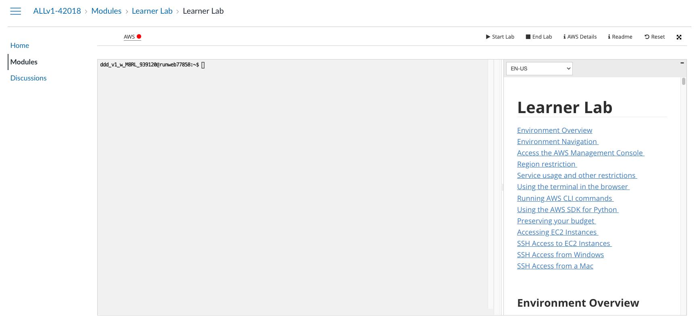

# Administracja sieciami komputerowymi 2023

---

# Lab1
**Cel ćwiczenia: Przygotowanie środowiska deweloperskiego dla rozproszonej aplikacji webowej**

## Uruchomienie platformy AWS Academy
1. Zaloguj się do platformy AWS Academy. Każdy powinien otrzymać zaproszenie na uczelniany adres mailowy. 
    
    Dane dostępowe:
    - login: <nr_indeksu>@student.agh.edu.pl
    - password: ustalony przy rejestracji
2. Z zakładki dashboard wejdź do kursu PH summer 2022/23 (Learner lab) i wybierz sekcję modules. Znajdują się w niej materiały przedstawiające korzystanie z platformy (Student Guide.pdf), terminal z dostępem do AWS (Learner lab) oraz ankieta podsumowująca (ja nie widzę wyników).
3. Uruchom konsolę wchodząc w Learner lab. Może być wymagane wyrażenie zgody na warunki korzystania z usługi. Rezultat, będący początkiem ćwiczenia, przedstawiono na poniższym rysunku.

    
4. By rozpocząć pracę z platformą, należy wystartować lab przyciskiem _Start lab_. Gdy przy linku do AWS zapali się zielona kontrolka, platforma jest gotowa do pracy. **UWAGA! Po zakończeniu pracy proszę wyłączać platformę przyciskiem _End lab_, by uniknąć niepotrzebnego wykorzystania środków**.

5. Wszelkie uwagi co do korzystania z platformy zostały zapisane w sekcji Readme, wyświetlanej domyślnie. Gdy nie jest ona widoczna, należy nacisnąć przycisk _Readme_.

## Zadania
### Tworzenie maszyny wirtualnej w usłudze EC2
1. Włącz konsolę AWS wciskając przycisk _AWS_. Nastąpi przekierowanie do konsoli webowej chmury Amazona.
2. Wejdź w usługę EC2. 
3. Stwórz parę kluczy w usłudze EC2, sekcja _Network & Security -> Key Pairs_. Zostanie ona wykorzystana do połączenia się z maszyną wirtualną, stworzoną w kolejnym kroku.
    - Nazwa: <nazwa_pary_kluczy> dowolna, możliwa do podglądnięcia w dowolnym momencie
    - Algorytm: ED25519
    - Format: .pem
    - **UWAGA! Klucz prywatny można pobrać tylko przy tworzeniu. Później nie jest to możliwe. Jego zgubienie skutkuje permanentnym zablokowaniem dostępu do maszyny.**
4. Po stworzeniu klucza nastąpi jego pobranie. Zapisz go w _bezpiecznym_ miejscu, oznaczonym jako <ścieżka_klucza_prywatnego>. By klucz mógł zostać wykorzystany przez kliena openssh, musi mieć uprawnienia 600.
5. Przejdź do sekcji _EC2 Dashboard_ w usłudze EC2 i stwórz nową instancję przyciskiem _Launch instance_ Parametry:
    - System operacyjny: według preferencji.
    - Typ instancji: t2.micro lub t2.small.
    - Para kluczy: <nazwa_pary_kluczy>.
    - Security group: stwórz tak, aby umożliwiała dostęp na porcie SSH.
    - Rozmiar i typ przestrzeni dyskowej: gp3, 30 GB.
    - Pozostałe parametry domyślne.
6. Po ustawieniu wszystkich parametrów, naciśnij przycisk _Launch instance_.
7. Jeżeli tworzenie zakończło się sukcesem, przejdź do _EC2 dashboard_ lub naciśnij link id instancji.
8. Po wybraniu instancji, wyświetli się podgląd wszystkich jej parametrów. Znajdź i skopiuj publiczny adres IPv4, oznaczony dalej jako <publiczny_adres>.
9. W dowolny sposób przetestuj połączenie SSH, wykorzystując skopiowany adres IP, pobrany klucz prywatny oraz domyślną nazwę użytkownika (dla Amazon Linux jest to ec2-user, dla Ubuntu jest to ubuntu). Przykład
    ```bash
    ssh -i <ścieżka_klucza_prywatnego> ec2-user@<publiczny_adres>
10. Jeżeli połączenie działa prawidłowo, to wcześniejsze kroki zostały wykonane prawidłowo i można przejść do dalszej drugiej ćwiczenia.

---

### Przygotowanie środowiska deweloperskiego na maszynie wirtualnej

1. Zaloguj się do stworzonej w usłudze EC2 maszyny wirtualnej.
2. Zainstaluj oprogramowanie niezbędne do uruchomienia aplikacji:
    - git do sklonowania repozytorium.
    - Backend: nodejs. Instalacja zależna od wyboru systemu operacyjnego. Aktualna wersja programu działa do wersji node 16. W 18 _mogą_ być problemy.
    - Frontend: nodejs do budowania, apache2 lub nginx do hostowania. Pliki w repozytorium zakładają nginx.
    - Baza danych: mariadb lub mysql.
3. Skolnuj niniejsze repozytorium na maszynę.
4. Uruchom Visual Studio Code lub inny edytor umożliwiający remote development (narzędzia Jetbrains mają taką możliwość). Dalszy opis bazuje na VS Code.
5. Jeżeli nie jest dostępna, zainstaluj wtyczkę Remote - SSH (Remote Explorer).
6. Podłącz się do wcześniej stworzonej maszyny wirtualnej, zgodnie z [dokumentacją wtyczki](https://code.visualstudio.com/docs/remote/ssh). Wybierz katalog ze sklonowanym repozytorium.
7. Jeżeli w eksploratorze widoczny jest kod źródłowy aplikacji, to wcześniejsze kroki zostały wykonane prawidłowo i można przejść do ostatniej części ćwiczenia.

---

### Uruchomienie aplikacji
1. W VS Code (lub innym IDE) uruchom terminal. Polecenia wykonane zostaną na maszynie wirtualnej.
2. Zweryfikuj czy baza danych jest uruchomiona (w systemach z systemd: `systemctl status mysql`).
3. Zaimportuj dane do bazy poleceniem:
    ```bash
    mysql -uroot < ./db/db.sql
    ```
    Ścieżka może się różnić, w zależności od wskazanego przy połączeniu Remote SSH folderu.
4. Zweryfikuj, czy import wykonany został prawidłowo. Przykładowo:
    ```bash
    mysql -udockerdb -p
    ```
    Hasło znajduje się w [zrzucie bazy danych](./db/db.sql#L19). Jeżeli logowanie przejdzie poprawnie, baza została zaimportowana.
5. Przejdź do katalogu z aplikacją backendową (server).
6. Zainstaluj zależności projektu poleceniem `npm install`.
7. Po instalacji zależności, uruchom aplikację w formie deweloperskiej (nodemon) poleceniem `npm run dev`.
8. Jeżeli aplikacja została uruchomiona, w terminalu wyświetli się komunikat o nasłuchiwaniu na konkretnym porcie.

### Część problemowa
Weryfikację tej części należy opisać i uzasadnić podejmowane kroki.

1. Sprawdź w przeglądarce, czy aplikacja backendowa działa. Adres: http://<publiczny_adres>:8080/api.
2. Sprawdź, czy działa połączenie aplikacji backendowej z bazą danych. Adres: http://<publiczny_adres>:8080/api/products. Wyświetlić powinna się lista produktów.
3. Uruchom aplikację frontendową w trybie deweloperskim. Wykorzystaj polecenie `npm start`.
4. W jaki sposób zbudować i uruchomić wersje produkcyjne aplikacji frontendowej oraz backendowej? Czy są jakieś różnice?

---

# Uwagi
1. Jako potwierdzenie wykonania ćwiczenia należy wykonać sprawozdanie w formie docx (pdf, preferowane) lub markdown.
2. Należy umieścić wszystkie niezbędne zdjęcia i opisy pokazujące przebieg ćwiczenia.
3. Sprawozdanie nie musi być bardzo szczegółowe, jednak powinno odzwierciedlać sekwencję wykonywanych kroków oraz uzasadnienie, co i dlaczego się stało.
4. Sprawozdanie należy umieścić na platformie UPEL do następnych zajęć.
5. Pozostałe dwa laboratoria wymagają wiedzy z tego ćwiczenia, gdyż będą wykorzystywać tą samą aplikację.