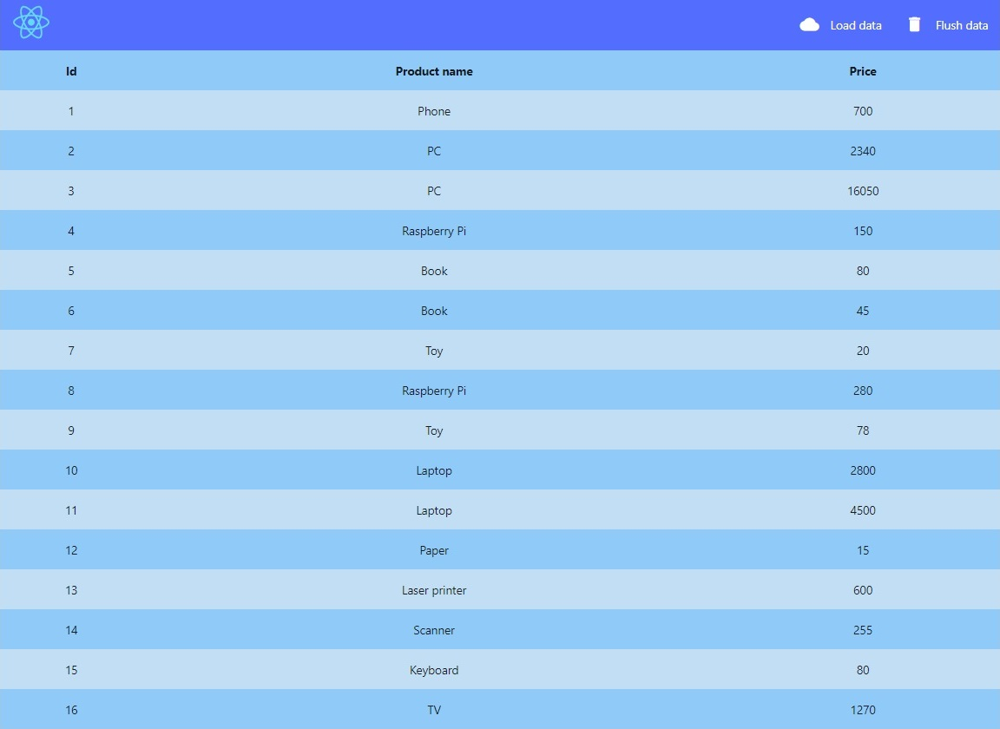
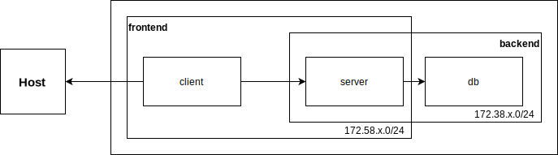

# ASK2020 lab01 docker
**Cel ćwiczenia:** Wykorzystanie konteneryzacji do przygotowania środowiska deweloperskiego aplikacji o rozproszonej architekturze

## Uruchomienie aplikacji bez dockera
Przed przejściem do wykonania zadania, przetestuj wpierw działanie aplikacji bez dockera.

### Wymagania
Do uruchomienia aplikacji potrzebne są:
* Git do sklonowania repo
* Node.js w wersji 12.16.3 (aplikacja działa również na wersji 10.19.0, dostępnej domyślnie w repo apt na Ubuntu) jako środowisko uruchomieniowe serwera oraz npm do jego wystartowania i instalacji zależności
* Nginx do uruchomienia klienta (można również przez npm)
* mysql/mariadb jako baza danych

### Kroki
0. Sklonuj repozytorium za pomocą `git clone` (lub wbudowanego narzędzia w IDE).
1. Uruchom bazę danych i wykonaj import ze [skryptu](db/db.sql):
    ```bash
    mysql -uroot < /path/to/db.sql
    ```
    Jeżeli wymagane jest hasło, dodaj opcję `-p`. Jest też możliwość wykorzystania polecenia `sudo` do połączenia się przez Unix socket jako root (serwer BD musi znajdować się na maszynie, z której uruchamiane jest polecenie):
    ```bash
    sudo mysql < /path/to/db.sql
    ```
2. Zainstaluj wszystkie zależności serwera, uruchamiając z katalogu [server](server) komendę `npm install`.
3. Uruchom serwer komendą `npm run dev`.
4. Zainstaluj zależności aplikacji klienckiej, uruchamiając w katalogu [client](client) komendę `npm install`.
5. Aplikację frontendową można uruchomić na dwa sposoby:
    1. W wersji deweloperskiej, z wykorzystaniem polecenia `npm start`.
    2. Produkcyjnie: zbuduj projekt poleceniem `npm run build`. Zostanie utworzony katalog _build_ z produkcyjną wersją aplikacji. Uruchom serwer nginx i umieść zawartość katalogu [client](build) w RootDirectory ([Nginx](https://stackoverflow.com/questions/10674867/nginx-default-public-www-location)). Przykładowa nazwa katalogu: docker-ui. Przykładowy config, za pomocą którego można uruchomić tą aplikację znajduje się w katalogu [client/nginx.conf](client/nginx.conf). Wymaga on pewnych modyfikacji.
6. W przeglądarce wejdź pod adres klienta z punktu 5. W przypadku nginx, domyślnie localhost/nazwa_serwisu, np. localhost/docker-ui. Jeżeli apka uruchamiana jest w wersji deweloperskiej, wówczas będzie to adres localhost:3000.
7. Poprawnie skonfigurowana aplikacja wyświetli listę produktów.
    

## Zadania
1. Uruchom aplikacje w dockerze, korzystając z [docker-cli](https://docs.docker.com/engine/reference/commandline/cli/). Stwórz odpowiednie [Dockerfile](https://docs.docker.com/engine/reference/builder/):
    1. [Node.js](https://hub.docker.com/_/node/). Uruchom serwer poleceniem `npm start`. Sprawdź poprawność działania, uruchamiając w przeglądarce endpoint: _localhost:8080/api/_.
    2. [MySQL](https://hub.docker.com/_/mysql) lub [MariaDB](https://hub.docker.com/_/mariadb). Zaimportuj schemat ze skryptu [db.sql](db/db.sql). Wykorzystaj [docker volume](https://docs.docker.com/storage/volumes/) do przechowania stanu bazy danych. Import można wykonać wykorzystując docker-cli lub pisząc odpowiedni Dockerfile.
    3. [Nginx](https://hub.docker.com/_/nginx). Kod źródłowy nie powinien znajdować się w kontenerze. Wykorzystaj w tym celu [multi-stage build](https://docs.docker.com/develop/develop-images/multistage-build/). W pierwszym stagu zbuduj projekt (`npm run build`), w drugim skopiuj build do nginx'a.
2.  Jeśli kontenery uruchamiają się bez błędów, przejdź do połączenia ich ze sobą, by klient wyświetlał poprawne dane.
    1. **Serwer**: Pamiętaj, by ustawić odpowiednie zmienne środowiskowe, zawarte w pliku [.env](server/.env), które wykorzystane zostały w [configu](server/src/config.js).
    2. **Baza danych**: Sprawdź, czy istnieje możliwość podłączenia się do bazy:
        ```bash
        docker exec -it container_name mysql -udockerdb -p
        ```
    3. **Klient**: W kontenerze należy uruchomić wersję produkcyjną aplikacji. Należy pamiętać, by nginx'a odwoływał się do poprawnych hostów. Config nginx powinien zawierać odpowiedni upstream do backendu, tak aby można było skonfigurować do niego proxy. Prawidłowy config znajduje się już w katalogu z klientem. Przeanalizuj jego budowę i opisz w sprawozdaniu.
3. Połącz odpowiednie kontenery ze sobą, korzystając z nazw kontenerów, zamiast adresów IP, korzystając **wyłącznie** z docker-cli.
4. Stwórz następującą konfigurację w formie [docker-compose.yml](https://docs.docker.com/compose/compose-file). Za `x` podstaw wartość obliczoną wg wzoru: `numer_albumu mod 200`. Na maszynę hosta udostępnij wyłącznie port do aplikacji klienckiej.
    

## Uwagi
1. Wydziel [zmienne środowiskowe](https://docs.docker.com/compose/environment-variables/) charakterystyczne dla różnych serwisów. Możesz w tym celu wykorzystać plik dotenv (.env).
2. Wykorzystaj [.dockerignore](https://docs.docker.com/engine/reference/builder/#dockerignore-file), by nie kopiować zbędnych plików i katalogów. Dotyczy to w szczególności kluczy, passphrasów, tokenów, itp. W niniejszym projekcie takie dane zawarte zostały w pliku .env.
3. Jeżeli wskazana w zadaniu pula adresów koliduje z Waszym DHCP, możecie zmienić ją na inną.
4. Przemyśl kwestię przechowywania stanu bazy danych. Usunięcie kontenera (lub `docker-compose down -v`) spowoduje usunięcie danych zawartych w bazie, w tym stworzonych wolumenów. Dla środowisk testowych nie jest to problemem, gdyż baza testowa zwykle nie ulega częstym zmianom i import ze skryptu wystarczy. Jednak w przypadku środowiska produkcyjnego jest to niedopuszczalne. [Więcej info](https://stackoverflow.com/questions/39175194/docker-compose-persistent-data-mysql).
5. W sprawozdaniu należy przedstawić sposób dojścia do finalnego rozwiązania. Proszę zawrzeć stosowne Dockerfile, komendy CLI, a w przypadku ostatniego zadania docker-compose. Opis powinien być sformułowany w sposób umożliwiający odtworzenie przebiegu ćwiczenia.

## Materiały
1. https://docs.docker.com/compose/networking/
2. https://docs.docker.com/compose/
3. https://docs.docker.com/network/network-tutorial-standalone/
4. https://stackoverflow.com/questions/43322033/create-database-on-docker-compose-startup/43324472
5. https://www.digitalocean.com/community/questions/how-to-ping-docker-container-from-another-container-by-name
6. https://dev.to/sonyarianto/how-to-spin-mysql-server-with-docker-and-docker-compose-33b2
7. https://runnable.com/docker/rails/docker-container-linking
8. https://serverfault.com/questions/989046/docker-compose-only-exposing-one-network-to-the-outside-world